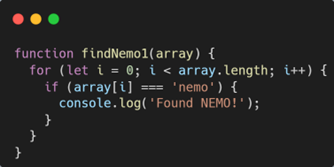
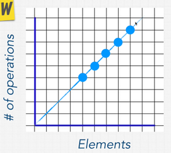
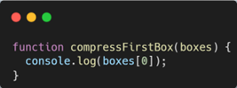
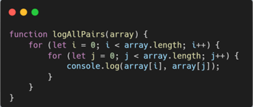
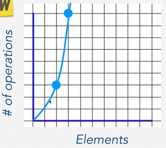
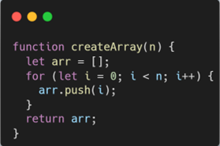
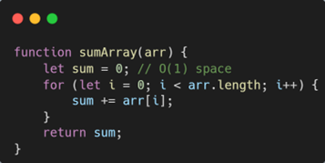
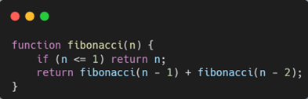
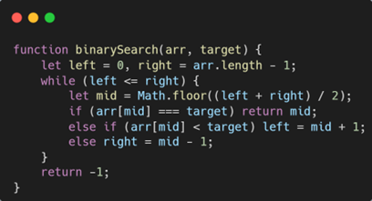

# Big O

## I. Big O and Scalability

### 1. Challenges with Measuring Runtime Directly

\- The runtime depends on factors such as:

- The computer's hardware (CPU speed).
- Other background tasks running on the computer.
- Programming language and implementation.

\- Comparing runtimes across different computers isn't fair or reliable.

### 2. The Role of Big O Notation       

\- **_Big O Notation_** provides a universal way to measure and compare the efficiency of algorithms, independent of hardware or system differences.

\- Big O focuses on **_how the number of operations grows_** as the input size increases, rather than the absolute runtime.

*Big O Complexity Chart*

\- **_Operations_** are the individual steps or actions that a computer performs when executing a function or algorithm. Examples of operations include:

- Comparing two numbers.
- Accessing an element in an array.
- Assigning a value to a variable.
- Incrementing a loop counter.
  
### 3. Scalability and Algorithmic Efficiency
\- **_Scalability_** refers to how well an algorithm performs as the size of the input grows larger.

\- **_Algorithms_** with slower growth in the number of operations are more efficient and better suited for scaling.

\- Big O helps quantify this growth and identify which algorithms will handle large inputs effectively.

### 4. O(n)

#### Analyzing the `findNemo` Function:
\- A function that logs the first item of an array always performs a single operation, no matter the size of the array.

#### Big O Notation for `findNemo`
\- The runtime grows linearly as the input size (n) increases.

\- This is described as **`O(n)`** or "linear time complexity".

\- n represents the number of inputs (or items in the array). As n increases, the number of operations increases proportionally.

### 5. O(1)

#### Analyzing the `compressFirstBox` Function:

\- A function that logs the first item of an array always performs a single operation, no matter the size of the array.

#### Big O Notation for `compressFirstBox`
\- O(1) is a flat line on the graph — the number of operations does not grow with input size. Even if the function performs a fixed number of operations (e.g., 2 or 3), it's still O(1).

\- Constant time functions are highly desirable in computing because they handle scalability exceptionally well.

## II. Simplifying BigO
\- A function with operations like O(3n) or O(3n + 5) simplifies to O(n).

\- A function with operations like O(n + 2) simplifies to O(n).

\- Why? Because Big O is about the growth rate of a function as the input grows. Constant factors and smaller terms become irrelevant for large inputs.

### 1. Rule #1: Worst Case
\- Big O ignores best-case scenarios or optimizations like break statements for most evaluations.

\- In the example of the Find Nemo function:

- Best case: Nemo is the first item → the loop runs once (O(1)).
- Worst case: Nemo is the last item → the loop runs through the entire array (O(n)).

\- Big O prioritizes worst-case analysis because real-world inputs are unpredictable. Scalability concerns require us to plan for the worst possible input, ensuring predictable performance.
### 2. Rule #2: Remove Constants
\- In Big O:

- Ignore constants (/2, +100, 2n).
- Focus on how the function scales with input size (n).
- Simplify life by using generalized notations like O(n).

\- The steepness of the line (e.g., O(2n) vs. O(n)) does not change the growth trend as n increases. Both are linear.
### 3. Rule #3: Different Terms for Inputs
\- Different inputs require separate consideration in Big O analysis.

\- Addition of complexities happens when loops are independent (e.g., O(n + m)).

\- Multiplication of complexities happens when loops are nested (e.g., O(n \* m)).
### 4. O(n^2)

\- Since you have two nested loops, both looping through the array, the time complexity is calculated as:

- O(n) \* O(n) = O(n^2), where n is the length of the array.
- This is known as quadratic time or O(n^2).

Quadratic time is slower than linear time (O(n)), and as the array size increases, the number of operations grows significantly.

### 5. Rule#4: Drop Non-Dominant Terms
\- When analyzing time complexity, we often encounter functions with multiple terms. In Big O notation, we focus only on the _dominant term_, which grows the fastest as the input size increases.

\- Non-dominant terms (like constants or lower-order terms) become insignificant as the input size grows, so we drop them.

\- Example:

- O(n + n^2). => O(n^2).
- O(x^2 + 3x + 1000 + x/2) => O(n^2).

## III. Space Complexity
### 1. Three pillars of Programming

\- Good code is about finding a balance between time complexity and space complexity. Ideally, your code should be both fast and memory-efficient, but in some cases, you might need to prioritize one over the other.

\- As a software engineer, your goal is to write code that is:

- Readable: Easy to understand and maintain.
- Efficient: Fast enough to handle large inputs and use memory wisely.
- Scalable: Able to handle growing inputs without significant performance drops.

### 2. Space Complexity: Heap and Stack

\- When a program runs, it uses two main types of memory: the heap and the stack.

- The `heap`: This is where variables that are dynamically allocated (e.g., objects, arrays, etc.) are stored. It’s where we store variables whose size or lifetime is not known in advance.
- The `stack`: This is where the function calls and local variables (like primitive data types) are stored. The stack grows and shrinks as functions are called and return.

Space complexity, much like time complexity, refers to how much memory a program needs to execute relative to the size of its input. It’s concerned with how many new variables or data structures we create and how much memory they require.

**Impact of Memory Usage:**

When we write code, we often have to make decisions about how much memory we’re willing to use. The goal is to find a balance between _**speed (time complexity)**_ and _**memory (space complexity)**._ Sometimes, we might prioritize memory efficiency over speed.

### 3. Factors That Affect Space Complexity

\- Space complexity is influenced by several factors:

- `Variable allocation`: How many variables or objects do we allocate in memory?
- `Data structures`: Arrays, objects, hash tables, and other structures take up memory, and the size of these structures can affect the overall space complexity.
- `Function calls`: Each function call consumes space on the stack, especially if there are recursive calls.
- `Memory allocations`: Creating new objects or arrays dynamically can increase memory usage.

### 4. Example

Space complexity: O(n) because the function creates an array arr whose size is proportional to the input n. As the value of n increases, the amount of memory required grows linearly.

The space complexity is O(1), as the space used does not grow with the size of the input array.

The space complexity is O(n) because the recursion depth depends on n.

The space complexity is O(1) because the algorithm only uses a constant amount of extra space.

## IV. Conclusion
Big-O is a standard way to evaluate the efficiency of a function or algorithm by analyzing:

- `Time Complexity`: How the number of operations grows with the input size.
- `Space Complexity`: How the memory usage grows with the input size.

Big-O focuses on the growth rate rather than exact measurements, making it a tool to compare algorithms, especially as input size increases.

***Key Simplification Rules for Big-O:***

- `Worst Case`: Analyze the algorithm’s performance in the worst possible scenario.
- `Remove Constants`: Ignore constant factors as they do not affect growth rate.
- `Different Term Input`: Analyze each input independently if multiple inputs exist.
- `Find Dominant Term`: Keep only the term with the fastest growth rate.

