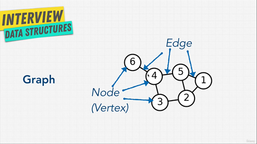
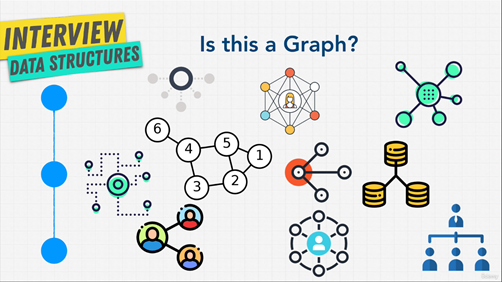
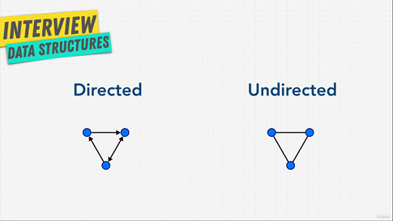
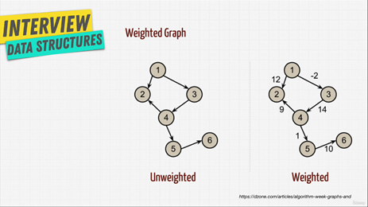
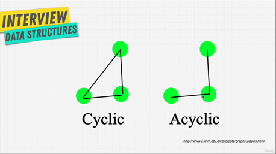

# Graphs

## 1. Introduction

### Definition

- A **graph** is **a set of nodes (vertices) connected by edges**. Represents pairwise relationships between values. Components:
  - **Node/Vertex**: Represents an individual entity
  - **Edge**: Represents the relationship between two nodes

### Applications

- Social networks (e.g., Facebook for friendships).
- Recommendation engines (e.g., Amazon for product suggestions).
- Navigation systems (e.g., Google Maps for shortest paths).
- Others: Family trees, the World Wide Web, road networks, etc.

### Key Properties

- Graphs are a versatile data structure for modeling real-world connections.
- Linked lists and trees are specific types of graphs.

## 2. Type of Graphs

### Directed & Undirected Graph

| Type             | Description                              | Example                |
|------------------|------------------------------------------|------------------------|
| Directed Graph   | Edges have direction (one-way).          | Twitter (user follows) |
| Undirected Graph | Edges are bi-directional (two-way).      | Facebook (friendship)  |

### Weighted vs. Unweighted Graph

| Type             | Description                                | Example                     |
|------------------|--------------------------------------------|-----------------------------|
| Weighted Graph   | Edges have weights (e.g., distance, cost). | Google Maps (shortest path) |
| Unweighted Graph | Edges do not carry additional information. | Basic networks.             |

### Cyclic vs. Acyclic

| Type            | Description                               | Example            |
|-----------------|-------------------------------------------|--------------------|
| Cyclic Graph    | Contains cycles (can return to the start).| Road networks.     |
| Acyclic Graph   | No cycles; cannot return to the start.    | Trees.             |

