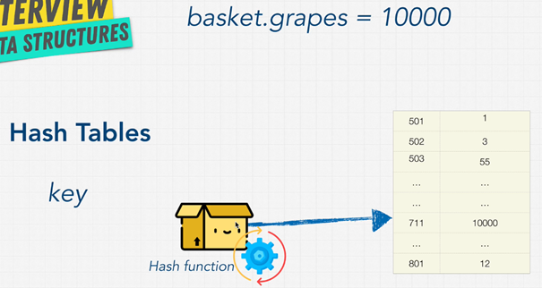
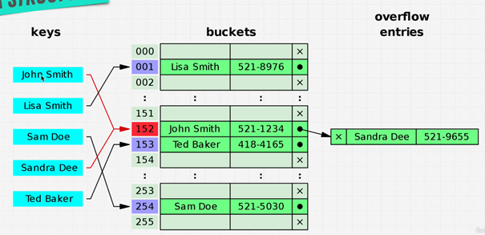

# Hash Table

## 1. Hash Function

### 1.1. Definition

A hash function generates a value of fixed length (hash) from an input.

Properties:

- Deterministic: Same input always produces the same output.
- One-way: You cannot reverse-engineer the input from the output.
- Sensitive to changes: Even minor changes in input (like capitalization) create a completely different output.

### 1.2. Examples

Common hash functions: MD5, SHA-1, SHA-256.

***Example:*** Input hello → Hash: 5d41402abc4b2a76b9719d911017c592.

### 1.3. Purpose in Hash Tables

Convert keys (e.g., "grapes") into an index or memory address to store and retrieve data efficiently.

Ensures O(1) time complexity for adding/retrieving data.

### 1.4. How It Works in Hash Tables

Key is passed through the hash function to generate a "gibberish" value.

This value is then mapped to an index or memory address for storage.

***Example:*** Key "grapes" → Hash → Mapped to memory address → Store value 10,000.

## 2. Hash Table

### 2.1. Definition

A data structure that stores data as key-value pairs.

Keys are used to find values efficiently.

### 2.2. How It Works

You provide a key (e.g., "grapes"), which is hashed using a hash function.

The hash is then mapped to a specific memory location (address) where the value is stored.

### 2.3. Operations

Insertion: O(1) time complexity. The key is hashed to find the memory address, and the value is stored there.

Lookup: O(1). The hash function maps the key to the memory address to retrieve the value.

Deletion: O(1). The key is hashed to locate and remove the value.

### 2.4. Hash Table Advantages

Fast Access: O(1) for insertion, lookup, and deletion.

No need to reorder: Unlike arrays, deleting items in hash tables doesn’t require index shifting.

Flexible key types: Strings, numbers, or other types can be used as keys.

## 3. Hash Collision

### 3.1. Memory Allocation

Hash table uses a limited number of buckets to store data.

If too much data is added, multiple keys may hash to the same bucket, causing collisions.

### 3.2. Collisions

Occurs when two keys map to the same bucket.

Slows down operations like insert, lookup, and delete.

### 3.3. Collision Handling

Separate Chaining: Store colliding keys in a linked list within the bucket.

Open Addressing: Find another empty bucket for the colliding key.
