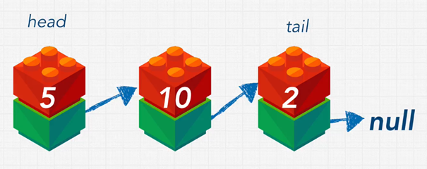

# Linked List

## 1. Problem with Arrays and Hash Table

### 1.1. Arrays

Static Arrays: Fixed size, limited memory allocation, and performance issues when resizing.

Dynamic Arrays: Can grow in size but resizing (doubling) can be costly (O(n) time).

Insertion/Deletion Issues: Shifting elements when inserting/deleting anywhere but the end of the array.

### 1.2. Hash Tables

Store data efficiently without worrying about memory allocation.

Drawback: Do not maintain order of elements.

## 2. Linked List

A linked list is a data structure made up of nodes, where each node contains:

- A value (the data you want to store, e.g., a number).
- A pointer (a reference to the next node in the list).

Singly Linked List: In a singly linked list, each node points to the next node, and the last node points to null, indicating the end of the list.

### 2.1. Key Terms

`Head`: The first node in the list.

`Tail`: The last node in the list, which points to null.

`Pointer`: A reference to the location of the next node in memory.

<p align="center">
    
</p>

### 2.2. How It Works

Nodes link to the next node in the sequence, forming a chain of nodes.

The list can be sorted or unsorted, and the nodes can store any type of data.

### 2.3. Advantages

Efficient Insertions/Deletions: Insert or delete nodes in the middle by adjusting pointers, no need to shift other elements like array.

Dynamic Memory Allocation: Nodes are scattered in memory, allowing flexible growth/shrinkage without requiring contiguous memory.

Maintains Order: Linked lists maintain an order of elements, unlike hash tables.

### 2.4. Disadvantages

Traversal for access: Accessing elements requires traversing the list from the head, taking O(n) time.

Slower iteration: Iteration through nodes is slower than arrays due to non-contiguous memory locations.

No random access: Cannot directly access elements by index like arrays can, requiring traversal to reach specific nodes.

### 2.5. Operations

- `Insert/Prepend`: O(1) (at the beginning).
- `Append (Add to End)`: O(1).
- `Lookup/Search`: O(n) (requires traversal).
- `Insert/Delete`: O(n) (requires finding the position).
- `Delete`: O(n) (requires finding the node).

## 3. Pointer

A pointer is simply a reference to another memory location, object, or node.

In programming, a pointer allows you to refer to the memory address where an object or data is stored, rather than copying the data itself.

```javascript
let objectOne = { a: true };
let objectTwo = objectOne
```

Example: In this case, objectTwo is a pointer to the same memory location as objectOne. Both objectOne and objectTwo point to the same object in memory.

In languages like `JavaScript`, memory management (garbage collection) is automatic, which makes it easier to work with memory.

In low-level languages, you must manually manage memory to avoid issues like memory leaks.

## 4. Doubly Linked List

A Doubly Linked List is a type of linked list where each node contains:

- A value (data).
- A next pointer (link to the next node).
- A previous pointer (link to the previous node).

### 4.1. Key Features

`Bi-directional traversal`: Can move forward (using next) and backward (using prev).

`Head`: First node with prev = null.

`Tail`: Last node with next = null.

<p align="center">
    
</p>

### 4.2. Advantages

Backward Traversal: Can traverse the list in both directions.

Improved Search:

- Can start search from both the head and the tail.
- Slightly faster when you know the general position of the data.
- Efficient Insertions/Deletions: Easier to add or remove nodes from both ends of the list.

### 4.3. Disadvantages

Extra Memory Usage: Each node requires more memory to store the prev pointer.

More Complex Implementation: Need to manage both next and prev pointers when adding or removing nodes.

### 4.4. Performance

Traversal: O(n) (still linear time).

Insertions/Deletions: O(1) at the head or tail.

Search: Technically O(n) but can optimize by starting from head or tail.

## 5. Compare Linked list vs. Doubly Linked list

| Aspect                | Singly Linked List                                           | Doubly Linked List                                      |
|-----------------------|--------------------------------------------------------------|---------------------------------------------------------|
| **Memory Usage**      | Requires less memory (no prev pointer).                     | Requires more memory (additional prev pointer).         |
| **Implementation**    | Simpler to implement.                                        | More complex due to prev pointer management.            |
| **Traversal**         | Only forward (cannot traverse backward).                     | Bi-directional: Can traverse forward and backward.      |
| **Insertion/Deletion**| Faster (fewer operations, no need to update prev).           | Slightly slower (must update both next and prev).       |
| **Use Case**          | - Limited memory or memory is expensive.                    | - Memory is not a major concern.                        |
|                       | - Fast insertion/deletion, especially at the beginning.      | - Need to traverse or search elements in both directions.|
| **Drawbacks**         | Cannot traverse backward; losing head loses the list.        | Higher memory usage and complexity.                     |
| **Common Use**        | More common in coding interviews.                           | Used when bi-directional operations are required.       |

## 6. Playground
```js
// Node structure for Linked List
class Node {
  constructor(value) {
    this.value = value; // Holds the value of the node
    this.next = null;   // Pointer to the next node, initialized as null
  }
}

// Linked List Implementation
class LinkedList {
  constructor() {
    this.head = null; // Pointer to the first node in the list
    this.tail = null; // Pointer to the last node in the list
    this.length = 0;  // Tracks the total number of nodes in the list
  }

  // 1. Append: Add a node to the end of the list
  append(value) {
    const newNode = new Node(value);
    if (!this.head) { // If the list is empty
      this.head = newNode; // Head and tail both point to the new node
      this.tail = newNode;
    } else {
      this.tail.next = newNode; // Update the current tail's next pointer to the new node
      this.tail = newNode;      // Update the tail pointer to the new node
    }
    this.length++; // Increment the length of the list
  }

  // 2. Prepend: Add a node to the beginning of the list
  prepend(value) {
    const newNode = new Node(value);
    if (!this.head) { // If the list is empty
      this.head = newNode;
      this.tail = newNode;
    } else {
      newNode.next = this.head; // Point the new node to the current head
      this.head = newNode;      // Update the head pointer to the new node
    }
    this.length++; // Increment the length of the list
  }

  // 3. Insert: Insert a node at a specific position (index)
  insert(index, value) {
    if (index < 0 || index > this.length) { // Validate index
      console.log("Index out of bounds");
      return;
    }

    if (index === 0) { // Insert at the beginning
      this.prepend(value);
      return;
    }

    if (index === this.length) { // Insert at the end
      this.append(value);
      return;
    }

    const newNode = new Node(value);
    let previous = this.head;

    // Traverse to the node just before the target index
    for (let i = 0; i < index - 1; i++) {
      previous = previous.next;
    }

    newNode.next = previous.next; // Connect new node to the next node
    previous.next = newNode;      // Connect the previous node to the new node
    this.length++; // Increment the length of the list
  }

  // 4. Delete: Remove a node at a specific position (index)
  delete(index) {
    if (index < 0 || index >= this.length) { // Validate index
      console.log("Index out of bounds");
      return;
    }

    if (index === 0) { // Remove the first node
      this.head = this.head.next; // Move the head pointer to the next node
      if (this.length === 1) this.tail = null; // Update tail if only one node existed
    } else {
      let previous = this.head;

      // Traverse to the node just before the target index
      for (let i = 0; i < index - 1; i++) {
        previous = previous.next;
      }

      previous.next = previous.next.next; // Skip the target node

      if (index === this.length - 1) { // If deleting the last node
        this.tail = previous; // Update the tail pointer
      }
    }

    this.length--; // Decrement the length of the list
  }

  // 5. Search: Find the index of the first node with the given value
  search(value) {
    let current = this.head;
    let index = 0;

    // Traverse the list to find the value
    while (current) {
      if (current.value === value) {
        return index; // Return the index if the value is found
      }
      current = current.next; // Move to the next node
      index++;
    }
    return -1; // Return -1 if the value is not found
  }

  // Print the entire list as an array
  printList() {
    const result = [];
    let current = this.head;

    // Traverse the list and collect all node values
    while (current) {
      result.push(current.value);
      current = current.next;
    }
    console.log(result); // Output the list as an array
  }
}
```

Usage:
```js
const list = new LinkedList();
list.append(10);
list.append(20);
list.append(30);
list.printList(); // Output: [10, 20, 30]

list.prepend(5);
list.printList(); // Output: [5, 10, 20, 30]

list.insert(2, 15); // Insert 15 at index 2
list.printList(); // Output: [5, 10, 15, 20, 30]

list.delete(3); // Delete node at index 3
list.printList(); // Output: [5, 10, 15, 30]

console.log(list.search(15)); // Output: 2 (index of value 15)
console.log(list.search(100)); // Output: -1 (value not found)
```