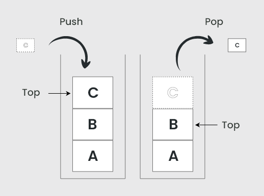
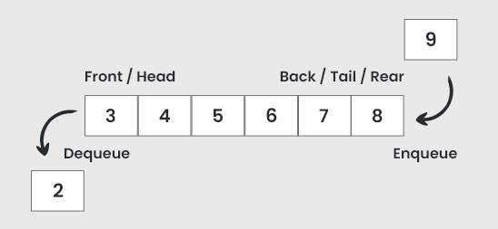

# Stacks & Queues

## 1. Stack

### 1.1. Definition

**Stacks** are **linear data structures** that follow the **LIFO (Last In, First Out)** principle.

Think of it as a stack of plates: you can only access the top plate

### 1.2. Real-world Use Cases

`Function Calls`: Programming languages use stacks to manage function calls. Example: Nested functions (A → B → C) are popped off the stack in reverse order.

`Browser History`: Clicking Back and Forward uses a stack to store page history.

`Undo/Redo`: Text editors use stacks to store previous states for undo and redo functionality.

### 1.3. Stack Operations

`push`: Add an item to the top of the stack.

`pop`: Remove the top item from the stack.

`peek`: View the top item without removing it.

    

### 1.4. Efficiency

Lookup: Traversing through the stack has a time complexity of O(n).
Stacks are not designed for random access like arrays.

### 1.5. Two approaches of implementing a Stack

*`Stack using array`*:

| Advantages                                                             | Disadvantages                                                                                 |
|------------------------------------------------------------------------|-----------------------------------------------------------------------------------------------|
| Simple and easy to implement.                                         | Push (array.push()) can be costly if the array resizes.                                    |
| Direct access to elements is possible (although not stack behavior). | Pop (array.shift() or unshift) is inefficient for large arrays when removing from the front. |
| Built-in array methods like push, pop, and peek are readily available. | Memory allocation can waste space if the array size is pre-reserved but unused.             |

*`Stack using linked list`*:

| Advantages                                                              | Disadvantages                                                             |
|-------------------------------------------------------------------------|---------------------------------------------------------------------------|
| Dynamic size: No need to pre-define size, making it more memory-efficient. | More complex to implement (requires managing nodes and pointers).         |
| Efficient operations: push and pop are always O(1).                       | Slightly higher memory consumption due to storing next pointers.          |
| No resizing issues like arrays.                                          | Traversing the stack (for printing or lookup) takes O(n).                 |
| Preferred for large datasets.                                            |                                                                           |

*`When to use each implementation`*:

| Scenario                          | Preferred Implementation                     |
|-----------------------------------|---------------------------------------------|
| Small stack size                  | Array (easy to implement).                  |
| Large and unknown stack size      | Linked List (dynamic size, no resizing).    |
| Operations limited to push/pop    | Linked List (efficient O(1) operations).    |
| Memory-efficient requirement      | Array (less overhead than linked list).     |

## 2. Queue

### 2.1. Definition

**Queues** are **linear data structures** that follow the **FIFO (First In, First Out)** principle.

Think of it like a roller coaster line: The first person in line gets served first.

### 2.2. Real-world Use Cases

`Waitlist Applications`: Concert tickets or restaurant reservations.

`Ride-Hailing Apps`: Uber or Lyft prioritize requests in the order they were made.

`Printers`: Printing jobs are handled in the order they were queued.

### 2.3. Queue Operations

`enqueue` (or `push`): Add an item to the end of the queue.

`dequeue`: Remove an item from the front of the queue.

`peek`: View the first item in the queue without removing it.

    

### 2.4. Efficiency

Using arrays to implement queues is inefficient because:

- Removing the first item (unshift) requires shifting all indexes.
- This results in a time complexity of O(n).

Queues are better implemented with linked lists for efficient enqueue and dequeue operations.
