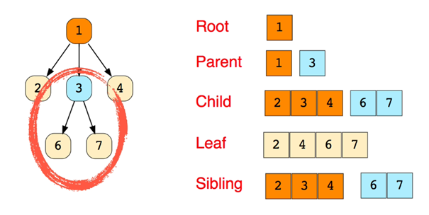
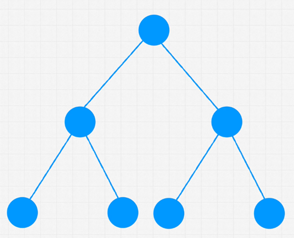
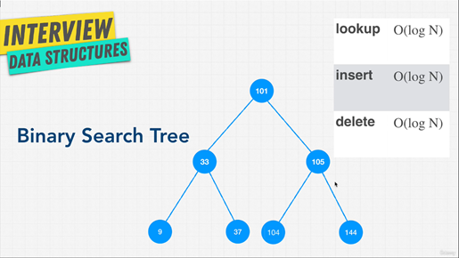
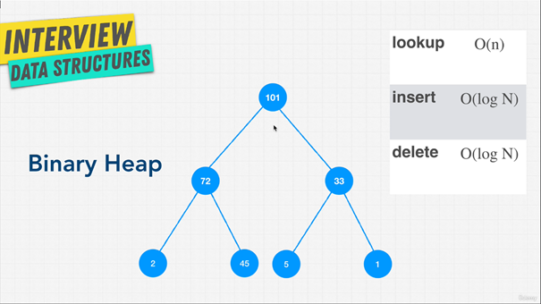

# Trees

## 1. Introduction

### 1.1. What is a Tree Data Structure?

A **hierarchical structure**, unlike arrays or linked lists which are linear.

Consists of nodes with a parent-child relationship:

- Starts with a root node.
- Nodes can have zero or more children.
- Each node has exactly one parent (except the root).
- Unidirectional relationship: parent → child.

### 1.2. Key Components in Trees

`Root Node`: The top-most node of the tree.

`Child Nodes`: Nodes that descend from a parent node.

`Leaf Nodes`: Nodes without any children.

`Subtree`: A smaller tree within a larger tree (any node with its descendants can form a subtree).

    

### 1.3. Everyday Applications of Trees

`Web Development`: The DOM (Document Object Model) is a tree structure with hierarchical HTML elements.

`Game Development`: Decision-making, such as in chess (e.g., calculating the best move).

`Social Media`: Comment threads (e.g., nested comments on Facebook).

`Programming`:

- Family Trees: Represent relationships hierarchically.
- Abstract Syntax Tree (AST): Used by compilers to parse and execute code

## 2. Binary Tree

### 2.1. What is a Binary Tree?

A type of tree with specific rules:

- Each node can have 0, 1, or 2 children.
- Each child can only have 1 parent.

    

### 2.2. Terminology

Perfect Binary Tree:

- All nodes have either 0 or 2 children (no nodes with just 1 child).
- The bottom-most level of the tree is completely filled.

Full Binary Tree:

- Similar to a perfect binary tree, but the bottom-most level does not need to be completely filled.

### 2.3. O(logN)

logN represents the height or levels of the tree required to perform an operation like searching. Example: A tree with 7 nodes has a height of 3 log2(8) = 3.

Steps in a Search: Searching in a binary tree requires at most logN steps

- Start at the root.
- Decide whether to go left or right.
- Repeat until the target node is found.

Each step eliminates half of the remaining nodes, leading to efficient searching.

## 3. Binary Search Tree

### 3.1. What is a Binary Search Tree (BST)?

A Binary Search Tree is a specialized type of binary tree designed for efficient searching, insertion, and deletion operations. It maintains a specific structure that makes it ideal for preserving relationships between data.

### 3.2. Key Rules of BST

Node Relationships:

- All child nodes to the right of a node must have greater values than the current node.
- All child nodes to the left of a node must have smaller values than the current node.

Binary Tree Property:

- Each node can have at most two children.

    

### 3.3. Why Use a Binary Search Tree?

`Preserves Relationships`: Unlike a hash table that stores key-value pairs without order, BSTs maintain a hierarchical relationship between data, similar to a folder structure in a computer.

`Efficient Lookup`: Searching for an element doesn’t require scanning all nodes.

### 3.4. Unbalanced BST

Unbalanced Structure:

- Occurs when nodes are inserted in a way that skews the tree (e.g., ascending or descending order).
- Example: Inserting 86 → 90 → 99 creates a linear structure instead of a balanced tree.

Performance Issues:

- Balanced BST: Lookup, insert, and delete operations are O(logN).
- Unbalanced BST: Operations degrade to O(N), similar to a linked list.

Why It's Bad:

- Inefficient Lookup: Traversing becomes linear, losing the advantage of binary search.
- Slower Operations: Insertion and deletion require traversing all nodes to find the correct position.

### 3.5. Solution: Balanced Trees

Balanced Trees ensure O(logN) operations by maintaining a balanced height. Types of Balanced Trees:

- AVL Trees: Height difference (balance factor) between left and right subtrees is ≤ 1.
- Red-Black Trees: Uses color rules to maintain approximate balance

### 3.6. Strengths and Weaknesses of BST

| Strengths                          | Weaknesses                                      |
|------------------------------------|------------------------------------------------|
| Good Performance: O(logN) for search, insert, delete. | No O(1) Operations: Slower than hash tables.     |
| Ordered Data: Sorted data for range queries. | Performance Degrades When Unbalanced: Can become O(N). |
| Dynamic Size: Grows without limits. |                                                |
| Parent-Child Relationships: Useful for hierarchical data. |                                                |

## 4. Binary Heap

Structure: Always a complete binary tree with left-to-right insertion, ensuring compactness and memory efficiency.

Order: The parent node has a higher priority (or value) than its children. No left-to-right ordering within siblings (e.g., 33 and 77 can be swapped).

Efficiency: No need for rebalancing as in binary search trees.

Representation: Can be efficiently implemented using arrays instead of nodes.

    

## 5. Priority Queue

A data structure where elements have priorities, and higher-priority elements are dequeued before lower-priority ones.

Behavior:

- Insertions happen left-to-right.
- Higher-priority elements "bubble up."
- Dequeues follow the order of priority (root first, then left-to-right).
